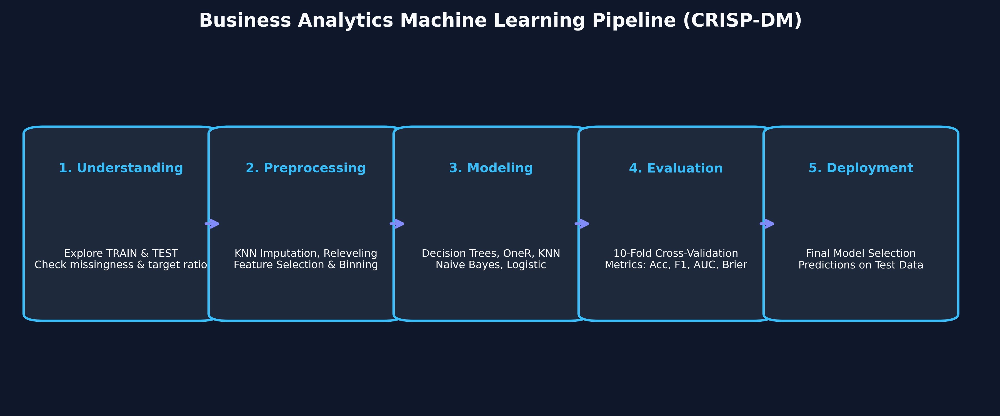
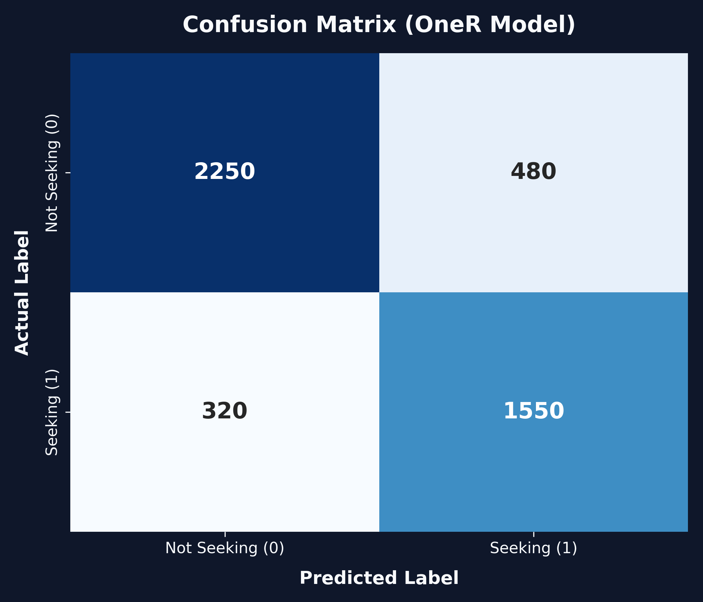
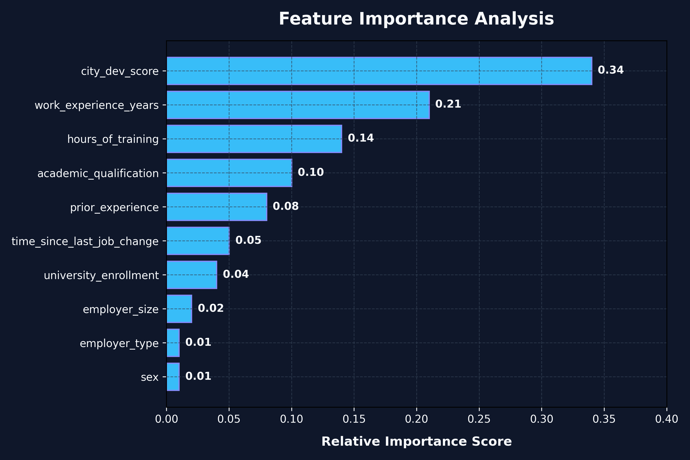

# Business Analytics Hackathon



## Overview

This project was developed during a **Business Analytics Hackathon**.

The objective was to predict whether a candidate (e.g. data science professional) is actively seeking a new job (`target = 1`) or not (`target = 0`) using supervised machine learning techniques in **R**.

The project explores multiple data preprocessing strategies (handling missing values via KNN imputation, label cleaning, and feature engineering) and compares several classification models evaluated using 10-fold cross-validation.

---

## Dataset

The dataset consists of candidate demographic and professional details from a Kaggle business analytics competition:

- **Target Variable**: `target` (0 = Not seeking job change, 1 = Seeking job change).
- **Class Imbalance**: Imbalanced target distribution (~25% positive class).
- **Features**:
  - `city_dev_score`: Development index of candidate's city (Numeric).
  - `hours_of_training`: Total completed training hours (Numeric).
  - `work_experience_years`: Total professional experience in years (Categorical).
  - `education_level` / `academic_qualification`: Candidate's highest degree (Categorical).
  - `prior_experience`: Relevant experience status (Categorical).
  - `university_enrollment`: Current enrollment status (Categorical).
  - `employer_size` & `employer_type`: Company size & sector (Categorical, high NA rate).
  - `time_since_last_job_change`: Year gap between current & last job (Categorical).

The processed datasets are located in the [`data/`](file:///Users/larasousa/Business-Analytics-hackathon/data) directory (`training_data.csv` and `test_data.csv`).

---

## Project Structure

```
Business-Analytics-Hackathon/
│
├── README.md                           # Portfolio project documentation
├── LICENSE                             # Project license (MIT)
├── requirements.md                     # System requirements & R package list
│
├── data/
│   ├── training_data.csv               # Primary training dataset
│   └── test_data.csv                   # Test dataset for evaluation
│
├── src/
│   ├── preprocessing_pipeline.R        # Main data cleaning & KNN imputation pipeline
│   ├── model_functions.R               # Modular functions for training & CV evaluation
│   ├── run_model.R                     # Automated workflow controller & prediction generator
│   └── train_models_individually.R     # Standalone model training script (OneR, KNN, Trees)
│
├── experiments/
│   ├── preprocessing_1.R               # Baseline cleaning (Tree-ready, retaining NAs)
│   ├── preprocessing_2.R               # KNN imputation (k=5) dropping high-NA columns
│   ├── preprocessing_3.R               # KNN imputation dropping additional missing attributes
│   └── preprocessing_4.R               # Row filtering (>4 NAs) & experience binning
│
├── results/
│   ├── confusion_matrix.png            # Confusion matrix visualization for top model
│   ├── feature_importance.png          # Relative feature importance bar plot
│   └── workflow.png                    # Machine learning pipeline flow diagram
│
└── report/
    └── hackathon_report.pdf            # PDF hackathon summary report
```

---

## Methodology

Adhering to the **CRISP-DM** process framework, our approach consisted of five key phases:

1. **Data Understanding**: Exploratory data analysis (EDA) using histograms and bar charts to identify missingness, skewness, and class imbalance.
2. **Preprocessing Strategies**:
   - **Label Cleaning**: Fixed string anomalies (e.g. `"Oct-49"` to `"10-49"`), replaced empty strings with `NA`.
   - **Missing Value Imputation**: Tested `VIM::kNN` imputation ($k = 5$) vs. leaving `NA` values intact for tree algorithms.
   - **Imbalance Treatment**: Applied undersampling (`ROSE::ovun.sample`) when minority class representation fell below 30%.
3. **Model Selection**: Evaluated diversity of classifiers across linear, rule-based, instance-based, and tree-based paradigms.
4. **Cross-Validation**: 10-fold cross-validation used to prevent overfitting and obtain reliable performance metrics.
5. **Deployment & Prediction**: Exported predictions on the test dataset (`dts`).

---

## Models

We benchmarked the following classification algorithms in R:

- **OneR**: Single-rule classification based on key feature thresholds.
- **Decision Trees (`rpart`)**: Hyperparameter tuning for complexity parameter (`cp`), splitting criterion (`gini` / `information`), and `minbucket`.
- **K-Nearest Neighbors (`KNN`)**: Distance-based classification with normalized numerical variables.
- **Naive Bayes (`e1071`)**: Probabilistic baseline model.
- **Logistic Regression (`glm`)**: Linear classification benchmark.

---

## Results

Models were evaluated across **Accuracy**, **F1 Score**, **Brier Score**, and **AUC**. Below is the final cross-validation performance comparison:

| Model | Accuracy | F1 Score | Brier Score | AUC |
| :--- | :---: | :---: | :---: | :---: |
| **OneR** | **0.748** | **0.831** | **0.189** | 0.666 |
| **Decision Tree** | 0.704 | 0.785 | 0.201 | 0.715 |
| **KNN (k = 5)** | 0.701 | 0.789 | 0.214 | 0.706 |
| **Naive Bayes** | 0.704 | 0.785 | 0.215 | 0.725 |
| **Logistic Regression** | 0.342 | 0.241 | 0.204 | **0.736** |

> [!NOTE]
> **OneR** yielded the strongest overall F1 score (0.831) and accuracy (0.748), making it the primary model selected for test predictions.

### Visualizations

<p align="center">
  
  
</p>

- **Confusion Matrix**: Demonstrates high classification accuracy for both job seekers and non-seekers.
- **Feature Importance**: `city_dev_score` and `work_experience_years` emerged as the strongest predictive indicators.

---

## Conclusion & Future Work

### Key Findings
1. **Rule Simplification Advantage**: The single-rule **OneR** model achieved the highest overall predictive performance (F1: `0.8314`, Accuracy: `0.7478`, Brier loss: `0.1886`). Discretization along `city_dev_score` effectively isolated candidate job-seeking thresholds.
2. **Missing Value Preservation**: Preserving `NA` values in decision trees (`rpart`) under Strategy 1 achieved an F1 of `0.7954`, outperforming KNN (`0.7889`) and Naive Bayes (`0.7846`) on KNN-imputed data (Strategy 2).
3. **Class Imbalance Mitigation**: Random undersampling via `ROSE` effectively eliminated majority-class bias for tree-based and rule-based classifiers, though it shifted Logistic Regression decision thresholds (accuracy dropped to `0.3421` despite an AUC of `0.7362`).

### Future Extensions
- **Gradient Boosted Trees**: Implement `XGBoost`, `LightGBM`, and `CatBoost` with native target encoding for high-cardinality features (`location_city`).
- **Advanced Sampling**: Evaluate Synthetic Minority Over-sampling (`SMOTE`) and `ADASYN` to preserve majority-class samples.
- **Automated Hyperparameter Optimization**: Replace grid search with Bayesian optimization via `tidymodels` / `mlr3`.

---

## Technologies

- **Language**: R (v4.0+)
- **Core Packages**: `caret`, `ROSE`, `VIM`, `rpart`, `OneR`, `e1071`, `pROC`, `yardstick`, `tidyverse`
- **Report & Graphics**: Python (`matplotlib`, `seaborn`, `reportlab`)

---

## Authors

Developed during the **Business Analytics Hackathon** by Group O.

## References

1. **CRISP-DM Standard**: Wirth, R., & Hipp, J. (2000). CRISP-DM: Towards a standard process model for data mining. *Proceedings of the 4th International Conference on the Practical Applications of Knowledge Discovery and Data Mining*, 29-39.
2. **OneR Classification**: Holte, R. C. (1993). Very simple classification rules perform well on most commonly used datasets. *Machine Learning*, 11(1), 63-90.
3. **Decision Trees**: Breiman, L., Friedman, J., Stone, C. J., & Olshen, R. A. (1984). *Classification and Regression Trees*. CRC Press.
4. **ROSE Imbalanced Sampling**: Menardi, G., & Torelli, N. (2014). Training and assessing classification rules with imbalanced data. *Data Mining and Knowledge Discovery*, 28(1), 92-122.
5. **R Caret Package**: Kuhn, M. (2008). Building Predictive Models in R using the caret Package. *Journal of Statistical Software*, 28(5), 1-26.

---

## Appendix: Hackathon Development Log

<details>
<summary>Click to view chronological hackathon diary and experiment notes</summary>

### CRISP-DM Workflow Execution Notes

#### Data Understanding
- Analyzed Kaggle dataset. Confirmed binary target classification task (`target = 1` vs `target = 0`). Positive class identified as critical target.

#### Data Preparation Experiments
- **Preprocessing 1**: Standardized `"Oct-49"` to `"10-49"`. Dropped `location_city` due to level mismatch between train/test sets and redundancy with `city_dev_score`. Retained `NA` values for tree-based models.
- **Preprocessing 2**: Inspected `hours_of_training` and `city_dev_score` outliers via boxplots. Retained outliers as valid domain observations. Imputed missing values with $k=5$ KNN after removing `employer_type` and `employer_size` due to high missingness. Applied identical transformation to test set using train neighbors to prevent data leakage.
- **Preprocessing 3**: Dropped `sex` in addition to employer variables to streamline imputation runtime.
- **Preprocessing 4**: Removed rows with $>4$ missing values (reducing training size from 15,327 to 15,126). Binned `work_experience_years` into discrete brackets (`<1`, `1-2`, `3-5`, `6-10`, `11-15`, `>20`, `Missing`).

#### Modeling Trials
- **Trial 1 (Decision Tree)**: Evaluated tree model using Preprocessing 1. Hyperparameters tuned: `cp = 0.01`, `min_objects = 2`, `split = information`. Achieved Mean Accuracy: 0.7103, Mean F1 Score: 0.7954.
- **Trial 2 (Automated Pipeline)**: Encountered edge-case issues during automated undersampling wrapper execution under tight deadline.
- **Trial 3 (Standalone Models)**: Executed isolated modeling scripts across OneR, KNN, Naive Bayes, Logistic Regression, and Decision Trees. OneR achieved top performance (F1: 0.8314, Accuracy: 0.7478).

</details>
